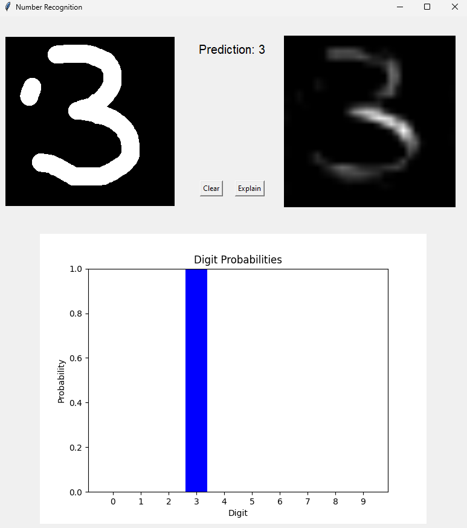

<!-- PROJECT LOGO -->
<br />
<div align="center">
  <h1 align="center">Handwritten number recognition using CNN model</h1>
</div>




<!-- ABOUT THE PROJECT -->
## About The Project

A PyTorch CNN model is trained to recognize handwritten numbers from 0 to 9. The app allows users to write a number on UI and then the model predicts the number. 

The model also includes an Integrated Gradient explainer to indicate which parts of the image contribute to the prediction.

<!-- GETTING STARTED -->
## Getting Started


### Installation

1. Clone the repo
   ```sh
   git clone https://github.com/trungmac07/Number_Recognition.git
   ```
2. Install related packages
    ```sh
    pip install -r requirements.txt
    ```

<!-- USAGE EXAMPLES -->
## Usage

### Training

Open the file "MINIST_train.ipynb".

The file written as Jupyter Notebook contains full code and guidelines for training


### GUI Application
Run the following command:
```bash 
python.exe Number_Recognition.py
```

The UI will be shown after few seconds
The UI is simple. Draw your number (from 0 to 9) to the left board and the model will predict it. Then click the button "Explain" to see the explanation (the saliency map) which part of the image most contribute to the predicted result .

<!-- CONTACT -->
## Contact

Email: mttrung16@gmail.com

Project Link: [https://github.com/trungmac07/Number_Recognition](https://github.com/trungmac07/Number_Recognition)

